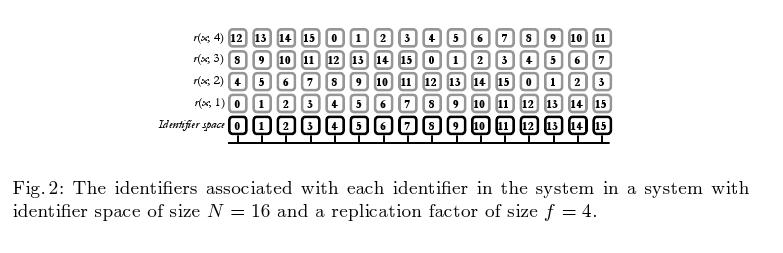

# Key-Value-Stores

---

# Introduction

* Tokyo-Cabinet
* Voldemort
* Riak
* Scalaris
* Demo application

---

# Tokio Cabinet

---

# Overview

* key-value store
* file/memory based storage engine
* written in c
* drivers/bindings for python, java, nodejs, ruby, etc.
* developed by FAL Labs
* free software (LGPL)
* superseded by Kyoto Cabinet

---

# Basic operations

* PUT
* GET
* DELETE
* KEYS
* CONCAT

---

# Architecture

* four database types:
    * B+Tree
    * hash table
    * fixed-length array
    * tables
* thread safe library for processes
    * read/write locks per record or file
* write ahead logs
* ACID

---

# Hash Database (TCHDB)

* static hashing
* unique keys
* memory mapping of database file
* compression e.g. deflate, bzip2
* iteration (random order)
* collision handled by separate chaining
    * binary search tree

---

# B+Tree Database (TCBDB)

* B+Tree index
    * pages in a double linked list
* duplicated keys possible
* LRU page chaching
* prexif/range queries through custom comparision function
* cursors allow iteration over values in an order

---

# Fixed-length Database (TCFDB)

* like an array
* keys are natural numbers
* time and space efficient
* memory mapped database file

---

# Table Database (TCTBD)

* column based
    * primary key and named columns
* query by column values
    * B+Tree based index
* lexical/decimal ordering by column values

---

# Summary

* file based Key-Value-Store
* "simple", basic operations
* library on process level

---

# Voldemort

</img>

<!-- taken from Project Voldemort ppt from http://www.svforum.org/index.cfm?fuseaction=Document.filterdocumentlist&topicRadio=Topic&topicOnly=32&docPublishYear=getAllYears -->

---

# Overview

* open-source reimplementation of Amazon Dynamo
* started by linkedIn
* latency is top priority
* now on github
* written in Java
* Clients in Java, Ruby, PHP, C++

---

# Data Model

* data in "stores"
* keys in stores unique
* one to many relations by lists
* serialization pluggable
    * json
    * string
    * java-serialization
    * protobuf
    * identity (bytes)
    * write your own

---

# Basic Operations
* PUT       - put(key,versionedValue)
* GET       - get(key)
* GET\_ALL  - get(keylist)
* DELETE    - delete(key, version)

---

# Architecture

</img>
<!-- taken from http://project-voldemort.com/design.php -->

---

# Eventual Consistency

* write to up to all replicas
* read-repair
* Hinted Handoff
    * any-handoff (to any server)
    * consistent-handoff (to server where replicas lie)
    * proximity-handoff (to a server geographical near)
writes can be done to every node (in emergency) - periodically tries to update correct node

---

# Replication

* consistent hashing to store & retrieve data
* updates of outdated data by reads and writes
* versions controlled by Vector Clock

---
# Storage Engines
* MySQL
* Memory
* read-only-storage
    * generated by Hadoop batch
    * can be pushed to server on runtime

---

# Summary

* distributed Key-Value-Store
* basic operations
* replication
* version control/consistency

---

# Riak

---

# Overview

* written in Erlang
* developed by Basho Technologies, Inc.
* enterprise and open source version
* drivers in Erlang, Java, Ruby, Node

---

# Overview

* Key-Value-Store
    * Document-Store?
* distributed (p2p)
* eventual consistent
* replication

---

# Data Model

* Buckets
    * set of key, value tuples
* Keys
    * identifier for values in a Bucket
* Values
    * actual data
* Meta-Data
    * vector clock, content type
* Links
    * Pointers (Keys) to other values

---

# Basic Operations

* put, get, delete
* list buckets
* list keys

---

# Architecture

* Cluster: Set of physical hosts
* each hosts runs a Riak node
* each Riak node runs a set of virtual nodes (vnodes)

---

# The Ring

<!-- Insert formula for partitions per vnode here -->

* diveded into partitions
    * number of partitions is configurable
    * "weighten" of hosts not possible (not implemented)
* vnodes "claim" a partition
* 160-bit binary hash of bucket/key pair
* every host in the cluster can function as coordinator
* gossip protocol to share ring state

---

# The Ring

<!-- image stolen from http://wiki.basho.com/ -->

</img>

---

# Replication

* Replication along the ring
* configurable per bucket
* handoff protocoll if nodes are unavailable
* *n_val*: number of copies stored in the cluster
* *w*: number of nodes that must return for successful read
* *r*: number of nodes that must return for successful write
* "no guarantees that the three replicas will go to three separate physical nodes"

---

# Backends (Storage engines)

* leveldb
    * Key-Value-Store
    * persistent
    * high throughput
* bitcask
    * all keys in memory
    * write into memory then write to disk
* in-memory
    * every thing in memory
    * time to live for key/value pairs
* and others

---

# Query-Language

* Map/Reduce
    * Key-Filters
* Secondary Indexes

---

# Map/Reduce

* process the whole data set
* devided in map and reduce phase
* queries written in:
    * Erlang
    * Javascript
* executed on every node in the cluster

---

# Key-Filters

* map/reduce queries over keys
* can be used as input for a map/reduce job
* predicates like:
    * equal, greater than, member of set
* combine with logic operaters (and, or, not)

---

# Secondary Indexes

* Index on independent values
    * schema free
* indexable types: int, binary
* local index per Partition
* you have to query all hosts in the cluster

---

# Summary

* advanced distributed Key-Value-Store
* query language
* replication
* eventual consistency

---

# Scalaris

---

# Overview

* distributed key-value-store
* based on a Distributed HashTable
* written in Erlang
* similar to Amazon's SimpleDB
* ACID properties (!)
* Zuse Institut Berlin, onScale solutions GmbH
* funded by EU projects
* Java, Python, Ruby APIs

---
# Basic Operations

* delete(key) - only Erlang & Java
    * inconsistencies may occur!
* insert(key,value)
* lookup(key)

---
# Delete inconsitstency possibility

    Replica: r1             r2              r3              r4
    Version: 99             99              99              99
    Value:   foo            foo             foo             foo

    Now, you try to delete the item, but miss one replica.

    Replica: r1             r2              r3              r4
    Version: 99             -               -               -
    Value:   foo            -               -               -

    Now, you try to create the item again with version number 1 and a new value,
    but again you miss the first replica.

    Replica: r1             r2              r3              r4
    Version: 99             1               1               1
    Value:   foo            bar             bar             bar

    The next read can again return the item with version number 99.
---

# Architecture

* P2P layer
* Replication layer
* Transactional Layer
* Application layer

---

# P2P layer

* Chord# - distributed dictionary
* key space is arbitrary set with total order
* every node has a random key
* logical ring + log_2(n) "fingers"

* stored in lexicografical order
* O(log(n)) routing performance

---

# Replication layer

* symmetric replication

</img>

---

# Transactional layer

* ACID properties
* improved Paxos Commit Protocol

</img>

---

# Consistency

* key, versionNumber, value
* highest versionNumber is determined then written
* quorum based operations (read and write majority)
* not persistent on disk
* several database backends (tokyo cabinet,...)
* crash-stop model
    * n/2 servers have to be available else loss of data

---

# Summary

* P2P based key-value store
* ACID properties
* not in memory
    -> not persistent

---

# Demo

---

# Timeline (Secondary Index)

Implement a timeline. Show blog posts in the last 5 minutes.

    !python
    client = riak.RiakClient()

    # compute time range
    end_time = int(time())
    start_time = end_time - 60*5

    # use a secondary index to fetch blog posts in the last 5 minutes
    post_links = client.index('posts', 'timestamp_int', start_time, end_time).run()

    # get actual data
    posts = [link.get().get_data() for link in post_links]

---

# Blogs and blog posts (link walking)

Get meta information about a blog and all blog posts.

    !python
    blogs = client.bucket('blogs') #bucket
    blog = blogs.get(blog_id) #blog (value)

    links = blog.get_links() # links

    # fetch all blog posts via link walking
    posts = [link.get().get_data() for link in links]
    blog = {
      'id': blog_id,
      'posts' : posts
    }

---

# Deployment

Install:

    git clone https://github.com/basho/riak.git
    cd riak
    make rel
    ./rel/riak/bin/riak start

Join the cluster:

    ./rel/riak/bin/riak-admin join dev1@127.0.0.1
    ./rel/riak/bin/riak-admin status

---

# Sources
* Scalaris
    * http://onscale.de/scalarix-learnmore.html
    * http://www.zib.de/de/pvs/projekte/projektdetails/article/scalaris.html
    * http://code.google.com/p/scalaris/
    * http://www.ist-selfman.org/wiki/images/0/0e/ZIBpaperOnPaxos.pdf
    * http://www.sics.se/~ali/publications/replication.pdf
* Voldemort
    * http://project-voldemort.com/design.php
    * http://project-voldemort.com/javadoc/all/
    * https://github.com/voldemort/voldemort/wiki/Hinted-Handoff
* Riak
* Tokyo Cabinet
